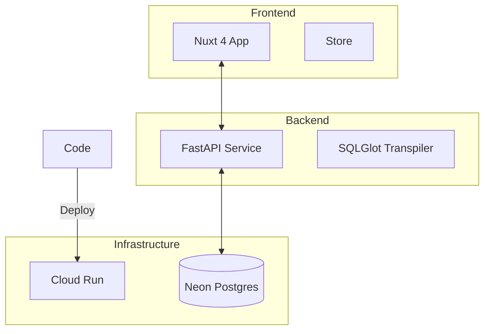

# 🎨 Entity Canvas

### Visual SQL Builder for Modern Teams

**Entity Canvas** is a high-performance, visual database exploration tool. It allows users to browse complex database schemas, build SQL queries via drag-and-drop, and execute them in real-time—all through a premium, interactive 4-pane workspace.

---

## 🏗️ System Architecture



## 🚀 Technical Highlights

- **Visual Query Building**: Drag-and-drop table columns to generate complex PostgreSQL.
- **Transpilation Engine**: Powered by **SQLGlot** for safe, dialect-aware SQL generation.
- **Modern Stack**: Nuxt 4, FastAPI, `uv`, and Nuxt UI.
- **Enterprise-Ready**: Multi-stage Docker optimization, modular API design, and automated testing.
- **Security-First**: Built-in SELECT-only SQL validation and configurable CORS policies.

## 📂 Documentation Portal

We maintain a comprehensive internal design and architectural record:

- **[Design Documentation Index](file:///d:/self_work/projects/entity_canvas/docs/design_docs/00_milestone_summary.md)**: Explore the technical design, milestones, and architectural decisions.
- **[DevOps & Setup](file:///d:/self_work/projects/entity_canvas/docs/design_docs/04_devops_cicd.md)**: Instructions for GCR deployment and secret configuration.
- **[Knowledge Base](file:///d:/self_work/projects/entity_canvas/docs/knowledge_base/01_tech_hurdles.md)**: Distilled learnings and technical "gotchas."
- **[Docker Dev Patterns](file:///d:/self_work/projects/entity_canvas/docs/knowledge_base/05_docker_dev_patterns.md)**: Deep dive into hot-reload and dependency shielding.

## 🛠️ Local Development

### Prerequisites
- **Docker & Docker Compose**
- Node.js 20+ (for local typegen)
- [uv](https://docs.astral.sh/uv/) (optional, for local backend development)

### Quick Start (Dockerized)
The easiest way to start the entire stack (Frontend, Backend, and a local Pagila Database):
```bash
# Start all services
docker compose up -d

# Generate shared types (requires backend to be up)
cd frontend && npm run typegen
```

### Manual Development (Outside Docker)
```bash
# Start Backend
cd backend && uv run uvicorn main:app --reload

# Start Frontend
cd frontend && npm run dev
```

> [!IMPORTANT]
> **Database Management**:
> - **Multi-Database Discovery**: The system now dynamically discovers all databases defined in `backend/.env`. Any variable starting with **`DATABASE_URL_`** (e.g., `DATABASE_URL_PAGILA`) will automatically appear in the workspace switcher.
> - **URL Hardening**: The backend automatically adds the `+asyncpg` suffix and handles SSL parameter fixes (e.g., `sslmode=require` -> `ssl=require`).
> - **Local Development**: If running **locally outside Docker**, use `localhost:5432`. If inside **Docker Compose**, use `host.docker.internal`.

---

> [!NOTE]
> **Entity Canvas** is currently optimized for PostgreSQL/Neon. Additional dialect support is planned for future milestones.
