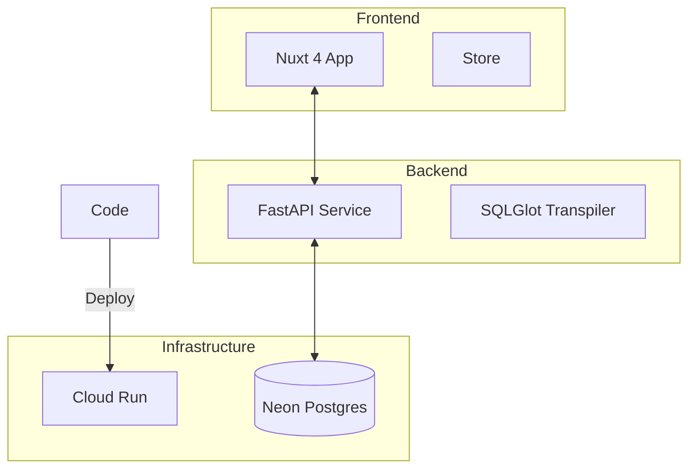

# 🎨 Entity Canvas

### Visual SQL Builder for Modern Teams

**Entity Canvas** is a high-performance, visual database exploration tool. It allows users to browse complex database schemas, build SQL queries via drag-and-drop, and execute them in real-time—all through a premium, interactive 4-pane workspace.

---

## 🏗️ System Architecture



## 🚀 Technical Highlights

- **Visual Query Building**: Drag-and-drop table columns to generate complex PostgreSQL.
- **Transpilation Engine**: Powered by **SQLGlot** for safe, dialect-aware SQL generation.
- **Modern Stack**: Nuxt 4, FastAPI, `uv`, and Nuxt UI.
- **Enterprise-Ready**: Multi-stage Docker optimization and full CI/CD deployment to Google Cloud.

## 📂 Documentation Portal

We maintain a comprehensive internal design and architectural record:

- **[Design Documentation Index](file:///d:/self_work/projects/entity_canvas/docs/design_docs/00_milestone_summary.md)**: Explore the technical design, milestones, and architectural decisions.
- **[DevOps & Setup](file:///d:/self_work/projects/entity_canvas/docs/design_docs/04_devops_cicd.md)**: Instructions for GCR deployment and secret configuration.
- **[Knowledge Base](file:///d:/self_work/projects/entity_canvas/docs/knowledge_base/01_tech_hurdles.md)**: Distilled learnings and technical "gotchas."

## 🛠️ Local Development

### Prerequisites
- Python 3.11+ & **[uv](https://docs.astral.sh/uv/)**
- Node.js 20+

### Quick Start
```bash
# Start Backend
cd backend && uv run dev

# Start Frontend
cd frontend && npm run dev
```

> [!IMPORTANT]
> **Database Connections**:
> - If running **locally outside Docker** (`uv run`), use `localhost` in `backend/.env`.
> - If running **inside Docker Compose**, use `host.docker.internal` to reach your host Postgres.
> - Ensure **`postgresql+asyncpg://`** is used for all connection strings.

---

> [!NOTE]
> **Entity Canvas** is currently optimized for PostgreSQL/Neon. Additional dialect support is planned for future milestones.
