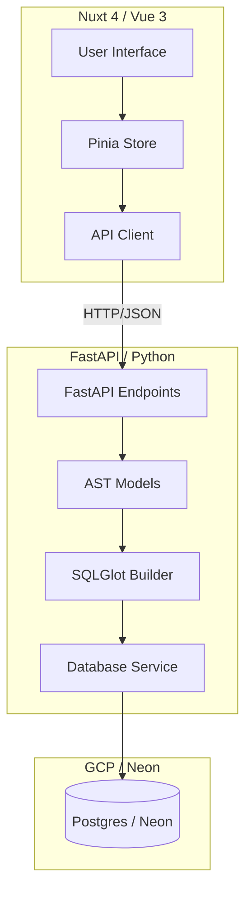

# Milestone 01: Project Scaffolding & Core Architecture

## Objective
Establish a high-performance monorepo foundation for Entity Canvas utilizing FastAPI (Backend) and Nuxt 4 (Frontend), unified by a shared Query AST.

## 🏗️ System Architecture



## State Changes
- **Pinia State**: Initialized `useQueryStore` to manage the `currentQuery` object (AST).
- **Reactivity**: Implementation of `ref` and `computed` properties for real-time SQL preview updates.

## API Contract
### `POST /api/query/execute`
- **Request (QueryAST)**:
  ```json
  {
    "from": "table_name",
    "select": [{"table": "t", "column": "c", "alias": "a"}],
    "where": [],
    "sorts": [],
    "limit": 100
  }
  ```
- **Response**:
  ```json
  {
    "sql": "SELECT ...",
    "results": [],
    "status": "success"
  }
  ```

## Technical Hurdles
- **PowerShell Compatibility**: Encounted `mkdir` positional argument errors during automated scaffolding; resolved by using `New-Item` logic.
- **Backend Import Paths**: Absolute imports (`from backend.models...`) caused `ModuleNotFoundError` in Docker; refactored to directory-relative imports.
- **uv Task Runner**: `uv run dev` required a specific entry point in `main.py` and `pyproject.toml` script definition.

## Verification
- [x] Backend starts via `uv run dev` with hot-reload.
- [x] Frontend starts via `npm run dev` and communicates with Backend.
- [x] Transpilation logic verified for simple SELECT/FROM/WHERE queries.

> [!NOTE]
> This milestone establishes the "Rules of Engagement" for the monorepo, including the strict use of `uv` and `SQLGlot`.
