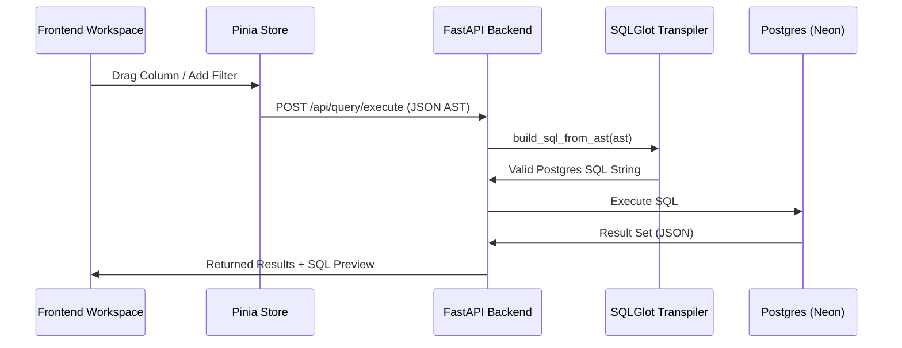

# Milestone 02: Query Engine & SQL Transpilation

## Objective
Implement a robust, injection-safe SQL transpilation engine using SQLGlot to convert JSON-based Query ASTs into PostgreSQL.

## 🏗️ Transpilation Lifecycle



## State Changes
- **Pinia State**: `queryStore.results` and `queryStore.generatedSql` are updated reactively upon every AST change.
- **Reactivity**: Added a **watch** on the query AST with a **debounce** to prevent excessive API calls during rapid UI manipulations.

## API Contract
### `POST /api/query/execute`
- **Request**: Comprehensive `QueryAST` including `joins`, `where` conditions, and `sorts`.
- **Response**:
  ```json
  {
    "sql": "SELECT ...",
    "results": [...],
    "status": "success"
  }
  ```

## Technical Hurdles
- **SQL Injection**: Prevented by using SQLGlot's expression builder instead of raw string formatting.
- **Type Casting**: Managing Pydantic `Union` types for `Condition.value` (Strings vs Numbers) required careful literal mapping in `services/sql_builder.py`.
- **Async DB Execution**: Integrating `asyncpg` with SQLAlchemy to provide non-blocking query execution.

## Verification
- [x] Complex SELECTs with aliasing verified.
- [x] Multi-condition WHERE clauses (AND/OR) verified.
- [x] Result set mapping to JSON objects verified.

> [!IMPORTANT]
> All SQL generation is hardcoded to the **PostgreSQL** dialect in this milestone to ensure 100% compatibility with our Neon integration.
