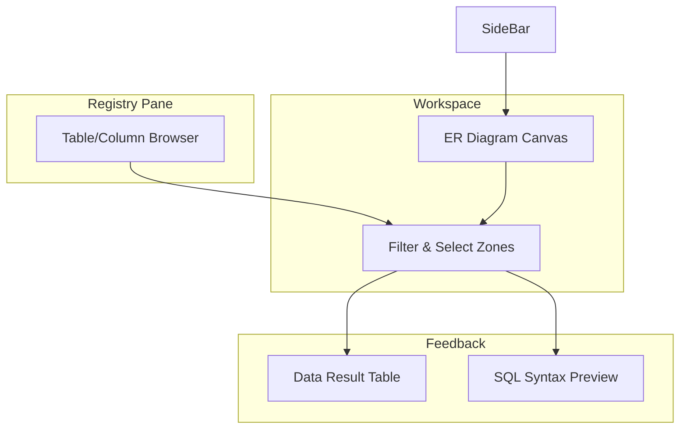

# Milestone 03: Interactive Workspace & UI Architecture

## Objective
Design and implement a highly interactive 4-pane workspace using Nuxt UI and Pinia, facilitating visual query construction through drag-and-drop.

## 🏗️ UI Architecture



## State Changes
- **Pinia State**: Implementation of `useWorkspaceStore` to track `selectionState` (hovered table, active column) and `canvasZoom`.
- **Reactivity**: Extensive use of **`shallowRef`** for nodes and edges in the ER Diagram (following rule 29) to avoid deep-tracking overhead.
- **Vapor Readiness**: Ensured that the logic for canvas manipulation lives in Pinia actions, keeping component scripts clean.

## API Contract
### `GET /api/schema`
- **Response**:
  ```json
  {
    "tables": [
      {
        "name": "users",
        "columns": [{"name": "id", "type": "INTEGER", "primary_key": true}]
      }
    ]
  }
  ```

## Technical Hurdles
- **Vue 3 Event Syntax**: Resolved `$arguments` property errors by refactoring child-to-parent event emission logic.
- **Tailwind At-Rule Warnings**: Suppressed IDE warnings by configuring specific PostCSS language associations.
- **Client-Side Rendering**: Wrapped interactive zones in `<ClientOnly>` to prevent hydration mismatches with browser-only Drag-and-Drop libraries.

## Verification
- [x] 4-pane layout responsive and functional.
- [x] Dragging columns from the sidebar registry successfully updates the Pinia store.
- [x] Interactive hover states in the ER Diagram properly sync with the Sidebar Registry.

> [!TIP]
> **Performance**: We use CSS Grid for the 4-pane layout to ensure zero-layout-shift (CLS) when panes are resized or toggled.
