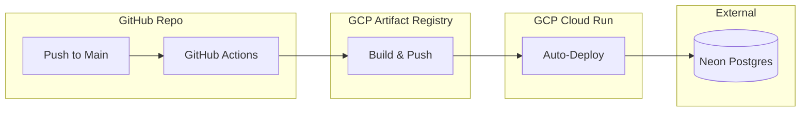

# Design Doc 04: DevOps, CI/CD & Deployment

## Overview
Status: **COMPLETED** | Milestone: 1 | Impact: Operations & Reliability

This document describes the automated pipeline and infrastructure architecture for **Entity Canvas**. We leverage **GitHub Actions**, **Google Cloud Platform (GCP)**, and **Neon** for a modern, serverless deployment.

## 🚀 Deployment Pipeline

## Infrastructure Components

### 1. Dockerization Strategy
We use **Docker** to ensure the application runs identically in development and production.
- **Backend**: Uses a single-stage build optimized for **uv**. It utilizes a non-root user (`appuser`) to adhere to security best practices for serverless environments.
- **Frontend**: Uses a **Multi-stage Build**.
  - *Stage 1*: Installs dependencies and builds the Nuxt application.
  - *Stage 2*: Copies only the `.output` directory into a minimal Node-slim image, reducing the production image size by ~70%.

### 2. CI/CD Pipeline (GitHub Actions)
Located in `.github/workflows/`, our pipelines automate the deployment of both services.
- **deploy-backend.yml**: Triggers on changes to `backend/**`.
- **deploy-frontend.yml**: Triggers on changes to `frontend/**` OR after a successful backend deployment. This "chained trigger" ensures the frontend can dynamically fetch the latest backend URL using `gcloud run services describe`.

### 3. Secret & Environment Management
We distinguish between **Repository Secrets** and **Environment Secrets** for maximum security.
- **Repository Secrets**: Global keys like `GCP_CREDENTIALS` (Service Account JSON).
- **Environment Secrets**: Secrets specific to the `production` environment, such as `GCP_PROJECT_ID`, `GCP_REGION`, and `NEON_DATABASE_URL`.

## Technical Definitions

- **Artifact Registry**: A GCP service for storing and managing Docker images.
- **Cloud Run**: A managed compute platform that enables you to run containers that are automatically scaled.
- **Environment Binding**: Our workflows use `environment: production` to explicitly pull secrets from the GitHub environment scope, preventing global secret leaks.

> [!WARNING]
> **Secret Validation**: If a deployment fails with "Service Unavailable," check if `NEON_DATABASE_URL` is correctly configured in the `production` environment secrets.

## Future Plans
- **Multi-Environment Support**: Adding `staging` and `development` environments with unique Cloud Run services.
- **Terraform Integration**: Moving infrastructure-as-code (IaC) for more reproducible GCP setups.
