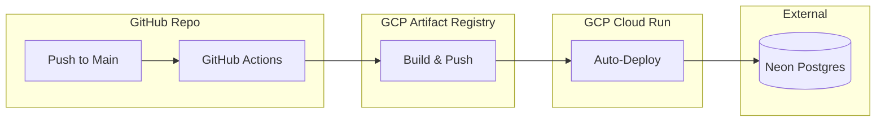

# Milestone 04: DevOps, CI/CD & Deployment

## Objective
Establish an automated CI/CD pipeline for deploying Entity Canvas to Google Cloud Run, featuring optimized multi-stage Docker builds and secure environment management.

## 🚀 Deployment Pipeline

## State Changes
- **Deployment Logic**: Implementation of a "Chained Trigger" where the Frontend deployment waits for the Backend to be healthy to ensure API URL synchronization.
- **Workflow Scope**: Added explicit `environment: production` to GitHub Actions jobs to enable access to Environment-specific secrets.

## API Contract
### Backend Service URL
- Resolved dynamically in Cloud Run via `gcloud run services describe`.
- Injected into the Frontend build process as an environment variable (`NUXT_PUBLIC_API_BASE`).

## Technical Hurdles
- **Docker Image Size**: Initial Nuxt image was >800MB. Resolved by implementing a multi-stage build that only copies the `.output` directory, reducing size to ~150MB.
- **GCP Secret Isolation**: Resolved "Context access might be invalid" warnings by moving secret-based environment variables from the global scope to the job scope.
- **Service Account Permissions**: Required specific IAM roles for the Service Account to push to Artifact Registry and update Cloud Run services.

## Verification
- [x] Backend deployed to Cloud Run successfully.
- [x] Frontend successfully built in 2 stages and deployed.
- [x] Full end-to-end communication from Cloud Run Frontend to Backend to Neon DB verified.

> [!CAUTION]
> **Secret Management**: Always use `environment: production` for secrets to prevent accidental leak of staging/development credentials.
