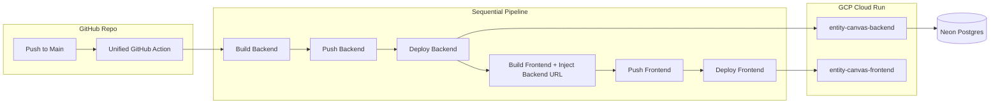

# Milestone 04: DevOps, CI/CD & Deployment

## Objective
Establish an automated CI/CD pipeline for deploying Entity Canvas to Google Cloud Run, featuring optimized multi-stage Docker builds and secure environment management.

## 🚀 Deployment Pipeline

## State Changes
- **Deployment Logic**: Shifted from a "Chained Trigger" (separate files) to a **Unified Workflow** (`deploy.yml`). This ensures that the Frontend build always has the latest Backend URL retrieved via `gcloud run services describe`.
- **Dynamic Port Resolution**: Implemented `os.getenv("PORT", 8000)` logic in the Backend `main:start` entry point to satisfy Cloud Run's health check requirements.

## API Contract
### Backend Service URL
- **Detection**: Resolved dynamically via `--project $PROJECT_ID` context in the unified workflow.
- **Injection**: Passed to the Frontend as `NUXT_PUBLIC_API_URL` during the Cloud Run deployment stage.

## Technical Hurdles
- **Port Mismatch (8000 vs 8080)**: Cloud Run requires containers to listen on the port provided by the `PORT` env var. Resolved by updating the Dockerfile to `EXPOSE 8080` and the app to listen dynamically.
- **Explicit Project Targeting**: Added `--project ${{ env.PROJECT_ID }}` to all `gcloud` commands to prevent service discovery failures in shared environments.
- **Docker Image Size**: Optimized Nuxt image via multi-stage builds (copying only the `.output` directory).

## Verification
- [x] Unified `deploy.yml` completes sequentially.
- [x] Backend passes health checks on Port 8080.
- [x] Frontend successfully captures and uses the dynamic Backend URL.
- [x] Full end-to-end communication verified.

> [!CAUTION]
> **Secret Management**: Always use `environment: production` for secrets to prevent accidental leak of staging/development credentials.
