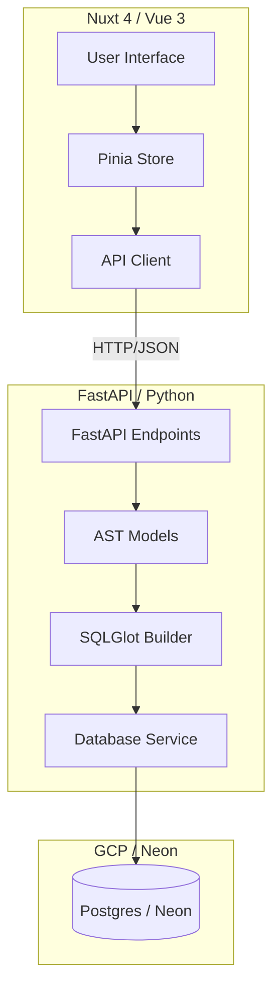

# Entity Canvas: Design Documentation Portal

Welcome to the technical design documentation for **Entity Canvas**. This portal serves as the entry point for understanding the system architecture, development history, and technical standards.

## 🏁 Development Milestones
The project maintains a strict technical audit log for every major feature epic.

- **[00_Milestone_Summary](file:///d:/self_work/projects/entity_canvas/docs/design_docs/00_milestone_summary.md)**: The active index and technical audit tracker for all project milestones.
- **[Design Docs Root](file:///d:/self_work/projects/entity_canvas/docs/design_docs/)**: Individual technical deep-dives for each feature (e.g., Scaffolding, Query Engine, Workspace).

## 🏗️ System Architecture

---

## 📂 Specialized Directories

### 💡 [Knowledge Base](file:///d:/self_work/projects/entity_canvas/docs/knowledge_base/01_tech_hurdles.md)
Distilled insights, hurdles, and technical "gotchas" discovered during implementation. Promoting items to the Knowledge Base is required for any hurdle taking >15 minutes.

### 🤖 [Agent Guidelines](file:///d:/self_work/projects/entity_canvas/docs/AGENT_GUIDELINES.md)
Developer and AI agent instructions to ensure repository integrity and adherence to the codified process flow.
